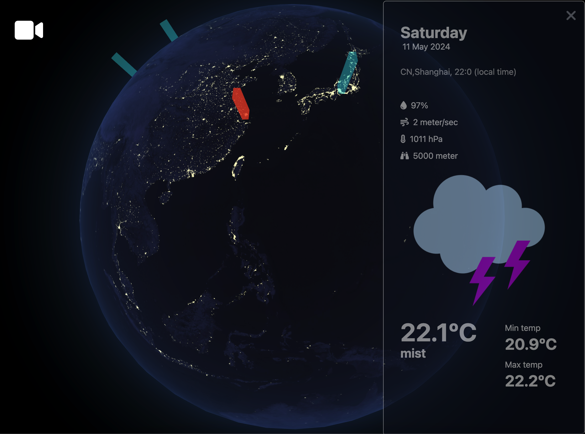
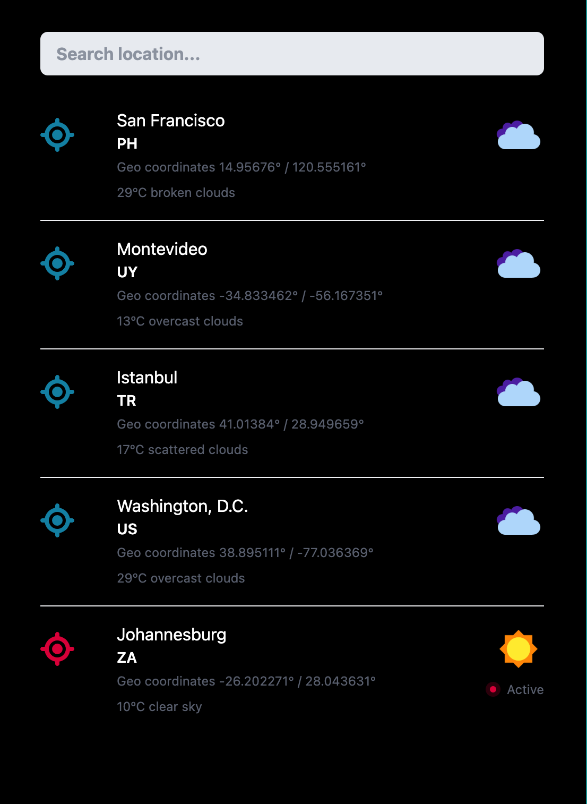

# Weather 3D globe
3D shading technologies for visualizing the universe and showing live weather forecasts. NASA images were used as textures.
[Preview. Click me](http://weather3d.online)
 

 

> [!NOTE]
> Tech stack: Javascript, GLSL shaders, Three.js

Interactive weather radar allows you to track precipitation in real time, to select the desired location, you should type in the search box (left panel)

## Camera controls
Using Orbit control camera from three.js lib
 

## Controlling the globe using motion
### Capturing a 3D object

### Rotate a 3D object

## Audio (For Future release)

 
Background music playback
